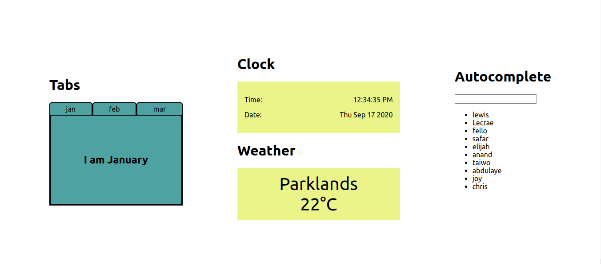

# react-widgets
This project is about building a responsive page containing four simple widgets. They include a clock, interactive tabs, a weather widget, and a simple search component.

## Livelink
[Live demo](https://affectionate-elion-321924.netlify.app/)

## Screenshot

## Built With
- React
- ES6
- NPM
- Webpack

## Getting Started
Get a local copy by cloning this repository

    git clone https://github.com/hillarioh/react-widgets.git

Go into the repository
    cd widget

Install dependencies vía NPM

    npm install

Start the application

    npm run start

## Authors

👤 **Hillarioh Okerio**

- Github: [@hillarioh](https://github.com/hillarioh)
- Twitter: [@hillaokri](https://twitter.com/hillaokri)
- Linkedin: [Hillarioh Okerio](www.linkedin.com/in/hillaryokerio)
- Email: (okerioh@gmail.com)

## 🤝 Contributing

Contributions, issues and feature requests are welcome!

## Show your support

Give a ⭐️ if you like this project!

## 📝 License

This project is [MIT](./LICENSE) licensed.